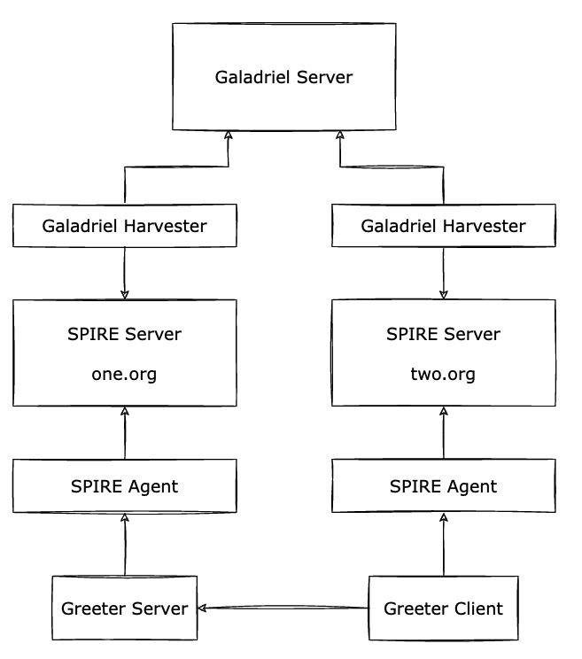

# Demo

The following demo script shows how to setup two simple SPIRE deployments and have them federated using Galadriel.

## Requirements

This demo only requires a `git` client and the `make` command properly installed in the system.

Tested on macOS Mojave and Ventura, and Debian Bullseye.

## Steps

Run the following scripts in order:

- `0-setup.sh`: This will make sure you have all SPIRE, Galadriel and the sample application binaries.
- `1-run-spire-servers.sh`: Runs two SPIRE Server instances, `one.org` and `two.org`.
- `2-run-spire-agents.sh`: Runs and attests two SPIRE Agent instances using join tokens.
- `3-run-galadriel-server.sh`: Runs an instance of the Galadriel Server.
- `4-create-members.sh`: Creates the member entities for both Trust Domains in Galadriel, and setups a federation relationship between them.
- `5-run-harvester.sh`: Runs two Galadriel Harvesters connected to the Galadriel Server and to each SPIRE Server.
- `6-create-entries.sh`: Creates the federated entries needed to attest the sample `greeter` application server and client.
- `7-run-greeter.sh`: Runs the greeter server and client.

The `greeter` server fetches its SVID from the SPIRE Agent serving `one.org`, and uses this credential to listen for incoming connections.

The `greeter` client fetches its SVID from the SPIRE Agent serving `two.org`, and uses this credential to connect to the server.

## Cleanup

Run `x-cleanup.sh` to remove from the system all the SPIRE bundle created by this demo.